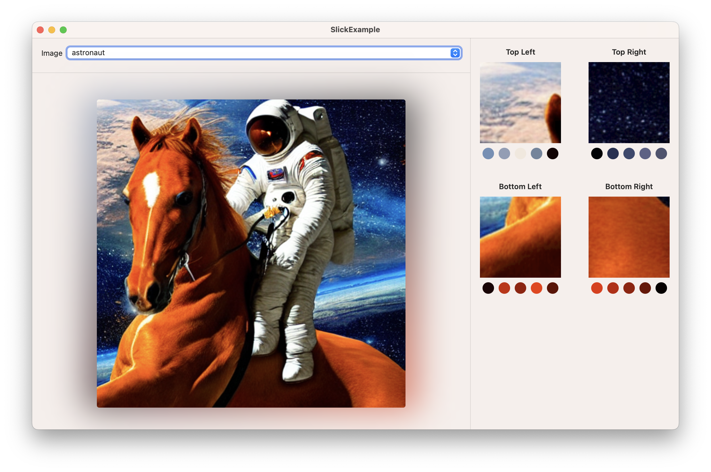

# Slick

A SwiftUI View for displaying a soft, backlit background around images (like an oil *slick*).

## Usage

Import `Slick` into the file for your SwiftUI `View` which will use the Slick view:

```swift
import Slick
```

Create a `SlickView`, passing the `NSImage` you want to display as the first parameter. `SlickView` takes
a trailing closure which you should use to render the image as you see fit.

For example, to display an image named `"astronaut"` in your app bundle:

```swift
SlickView(NSImage(named: "astronaut")) { nsImage in
  Image(nsImage: nsImage)
    .resizable()
    .aspectRatio(contentMode: .fit)
}
```

Which will render:


## Setup

### [Preferred] Swift Package Manager

Slick is best installed using the [Swift Package Manager](https://www.swift.org/package-manager/). Add the following to your target's `dependencies` in `Package.swift`:

```swift
dependencies: [
    ...,
    .package(url: "https://github.com/alexrozanski/Slick.git", .upToNextMajor(from: "1.0.0"))
]
```

Or add it as a dependency by specifying `https://github.com/alexrozanski/Slick.git` through Xcode's Package Dependencies UI.

### Manual

- Clone the Slick repository:

```bash
git clone https://github.com/alexrozanski/Slick.git # or git@github.com:alexrozanski/Slick.git with SSH
```

- Open `Slick.xcodeproj` in Xcode and build the `Slick` target in Debug or Release mode (depending on how you will be using the framework).
- Open the products folder from Xcode using Product > Show Build Folder in Finder from the Xcode menu.
- Find `Slick.framework` in either the `Debug` or `Release` folder (depending on how you built the framework).
- Drag `Slick.framework` to the Project Navigator (sidebar) of your Xcode project, checking 'Copy items if needed' and checking the correct target that you want the framework to be added to.

## Sample App

The `SlickExample` app shows an example of Slick in action, with some sample images and info showing which sections of the image and which colours were sampled.



## Credits

- Atomic Object's [blog post](https://spin.atomicobject.com/2016/12/07/pixels-and-palettes-extracting-color-palettes-from-images/) on extracting colours from images was very helpful in implementing the image colour extraction logic in Slick.
- Sample images generated using [Apple's runner](https://github.com/apple/ml-stable-diffusion) of Stable Diffusion on Apple Silicon.

## License

Slick is released under the MIT license. See [LICENSE](LICENSE) for more details.
